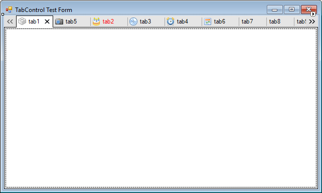

# TabControl #

The @Manina.Windows.Forms.TabControl winforms control contains multiple tabs. The control is based on [PagedControl](https://github.com/oozcitak/PagedControl).

The control has full designer support for adding/removing tabs and dragging child controls. It is also possible to programmatically add/remove pages by using the `Tabs` property of the control.

Tabs can be added at design time, or at run-time through the @Manina.Windows.Forms.TabControl.Tabs property of the control. 

The user can navigate between pages by setting the `SelectedTab` and `SelectedIndex` properties. Or calling the `GoBack` and `GoNext` methods for sequental navigation.

When a tab is switched, a number of events are fired by the control. Most important of these are the `PageValidating` and the `PageChanging` event. The latter allows the user to change the target tab or to cancel the tab change entirely.

